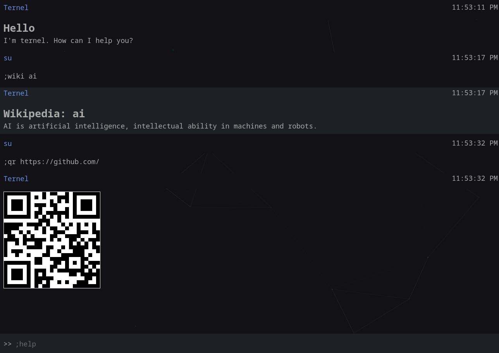

# Ternel

A terminal like interface to fetch many kinds of information such as 
IP information, password generation, qr etc.



## Commands

These are all the commands that are available.

- ```;pass``` - Generate passwords.
- ```;wiki``` - Fetch wikipedia article.
- ```;ip``` - IP information.
- ```;qr``` - Generate qr.
- ```;set``` - Configure and change settings.
- ```;help``` - Get help.
- ```;copy``` - Copyright information.

### Upcoming commands

- ```;zip``` - Get zip information.
- ```;cprg``` - Competitive programming info.

And many more. This is an ongoing project and I will be trying to 
add many useful commands.


To get additional information for a particular command execute ```;help
<command_name>``` such as ```;help pass``` (Don't include the *;*)

## Keybinding

- ```/``` Focus on the input element.

## Download

- `PWA` is available.
- Download [appimage](https://github.com/sujaudd1n/ternel/releases) for linux.
